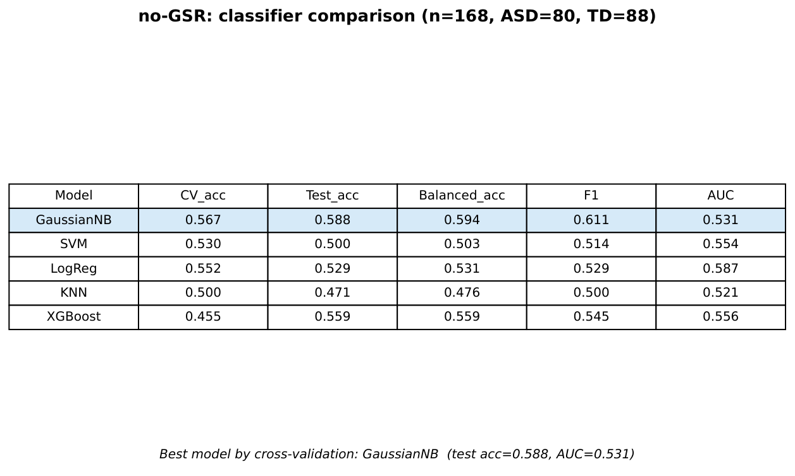
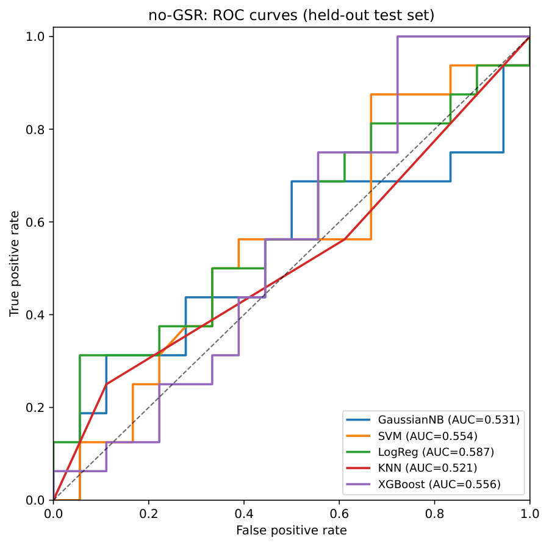
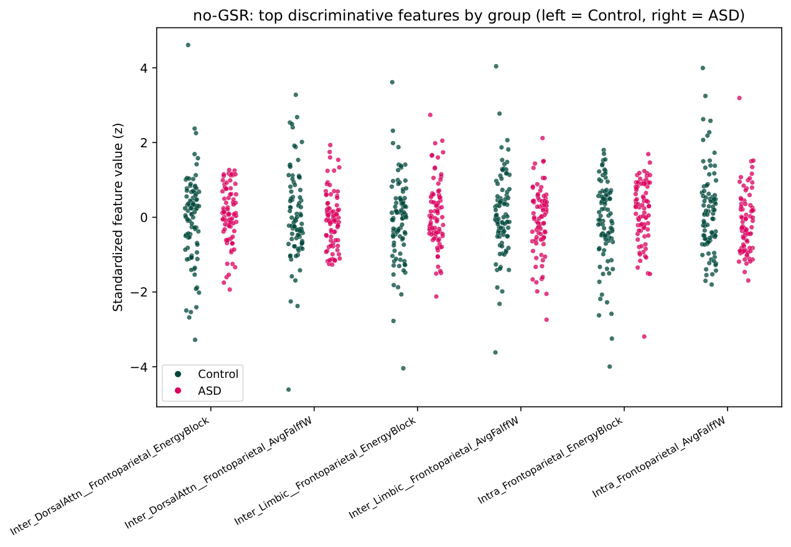

# Coevolutionary Balance of Resting-State Brain Networks in Autism

This repository contains code and data for analyzing coevolutionary balance in resting-state functional brain networks in autism spectrum disorder (ASD).

## Overview

We apply a coevolutionary balance framework to resting-state fMRI data from the ABIDE I repository. The approach combines binarized regional activity (fALFF) with signed functional connectivity to derive energy-based network descriptors at whole-brain, intra-network, and inter-network levels.

**Key findings:**
- ASD networks show more negative global coevolutionary energy
- Higher proportion of "agreement" links and lower "imbalanced-same" links in ASD (FDR p < 0.002)
- Altered inter-network energy involving Default Mode, Dorsal Attention, and Salience networks
- Gaussian Naive Bayes classifier achieves ~78% test accuracy (AUC = 0.79)

## Repository Structure

```
├── src/
│   ├── feature_extractor.py      # Extract network features from GraphML
│   ├── combat_harmonize.py       # ComBat batch effect correction
│   ├── statistical_analysis.py   # Group comparisons with FDR correction
│   └── ml_classification.py      # ML classification pipeline
├── data/
│   ├── features_ComBat_per_feature.csv         # Harmonized features (main data)
│   ├── net_cbt_all_features_3levels.csv        # Raw extracted features
│   └── net_cbt_all_features_3levels_with_center_iq.csv
├── results/
│   ├── figures/                  # Plots and visualizations
│   │   └── noGSR/                 # GSR-vs-no-GSR harmonization re-analysis figures
│   └── tables/                   # Statistical results
├── notebooks/
│   ├── MachineLearningClassification.ipynb     # Interactive analysis
│   ├── GSR_Harmonization_Fix.ipynb             # ComBat harmonization bug fix + re-statistics
│   └── ML_GSR_noGSR_Classification.ipynb       # ML classification on the fixed, harmonized features
├── requirements.txt
└── README.md
```

## Installation

```bash
# Clone repository
git clone https://github.com/yourusername/coevolutionary-balance-autism.git
cd coevolutionary-balance-autism

# Create environment
conda create -n coevol python=3.10 -y
conda activate coevol

# Install dependencies
pip install -r requirements.txt
```

## Quick Start

### Using Pre-computed Features

The repository includes pre-computed, ComBat-harmonized features. To run analysis:

```python
# Statistical comparisons
python src/statistical_analysis.py \
    --input data/features_ComBat_per_feature.csv \
    --output results/tables/stats_results.csv \
    --plots results/figures/

# ML classification
python src/ml_classification.py \
    --input data/features_ComBat_per_feature.csv \
    --output_dir results/
```

### Full Pipeline (requires raw data)

1. **Extract features** from GraphML files:
```bash
python src/feature_extractor.py \
    --asd_dir /path/to/ASD \
    --ctrl_dir /path/to/Control \
    --cc200 /path/to/CC200.nii \
    --yeo7 /path/to/Yeo7.nii \
    --output data/features_raw.csv
```

2. **Apply ComBat harmonization**:
```bash
python src/combat_harmonize.py \
    --input data/features_raw.csv \
    --phenotypic /path/to/Phenotypic_V1_0b.csv \
    --output data/features_harmonized.csv
```

### Notebooks

- `notebooks/MachineLearningClassification.ipynb` — interactive walkthrough of the main classification pipeline.
- `notebooks/GSR_Harmonization_Fix.ipynb` — fixes a ComBat harmonization bug (see below) and recomputes whole/intra/inter statistics, behavioral correlations, PLSR/PLSC, and signed-modularity analyses on genuinely harmonized features. Runs in ~1 minute from saved raw feature CSVs (no re-extraction needed).
- `notebooks/ML_GSR_noGSR_Classification.ipynb` — reruns the five-classifier, leakage-safe ML comparison (GaussianNB, SVM, LogReg, KNN, XGBoost) on the harmonized outputs of the fix notebook, for both the GSR and no-GSR pipelines, and regenerates the results table, ROC curves, permutation feature importance, PCA scatter, and top-feature strip plots as PDFs.

## Data

- **Source**: ABIDE I (http://fcon_1000.projects.nitrc.org/indi/abide/)
- **Sample**: 93 ASD and 93 TD adult males (18-30 years, IQ > 80)
- **Preprocessing**: CPAC pipeline
- **Parcellation**: CC200 atlas (200 ROIs) mapped to Yeo 7-network

## Methods

### Coevolutionary Energy

The Hamiltonian is defined as:

$$H(G) = -\sum_{i<j} s_i \cdot w_{ij} \cdot s_j$$

Where:
- $s_i \in \{-1, +1\}$ = binarized fALFF (high/low activity)
- $w_{ij}$ = signed functional connectivity weight

### Edge Types

| Type | Same State | Link Sign | Balanced |
|------|------------|-----------|----------|
| Agreement | Yes | + | ✓ |
| Disagreement | No | - | ✓ |
| Imbalanced Same | Yes | - | ✗ |
| Imbalanced Opp | No | + | ✗ |

## Results

### Statistical Comparisons (FDR-corrected)

| Feature | ASD Mean | TD Mean | p_FDR | d |
|---------|----------|---------|-------|---|
| Whole_Energy_global | -264.9 | -210.9 | 0.002 | -0.42 |
| Whole_Prop_agreement | 0.250 | 0.248 | 0.002 | 0.53 |
| Whole_Prop_imbalanced_same | 0.247 | 0.250 | 0.002 | -0.48 |

### Classification Performance

| Model | Test Accuracy | AUC |
|-------|--------------|-----|
| Gaussian Naive Bayes | **0.778** | 0.79 |
| SVM | 0.694 | - |
| KNN | 0.694 | - |
| XGBoost | 0.611 | - |
| Logistic Regression | 0.583 | - |

*Computed on the main, pre-harmonized feature matrix shipped in `data/`. See the next section for the GSR-vs-no-GSR harmonization fix and the corrected numbers it produces on that separate pipeline.*

## Harmonization Fix: GSR vs. no-GSR Re-Analysis

An audit of the GSR/no-GSR comparison pipeline found that ComBat harmonization was silently
failing: one ABIDE site (`CMU`) had only a single subject, which makes `neuroCombat` return an
all-NaN matrix, and the pipeline was falling back to **raw, un-harmonized** features without
raising an error. `notebooks/GSR_Harmonization_Fix.ipynb` fixes this by dropping under-populated
sites before harmonization and making ComBat **fail loudly** (raise an exception) instead of
silently degrading, so this class of bug can no longer hide in the results. It recomputes the
whole/intra/inter-network statistics, behavioral correlations, PLSR/PLSC, and signed-modularity
analyses on the genuinely harmonized data. `notebooks/ML_GSR_noGSR_Classification.ipynb` then
reruns the leakage-safe, five-classifier comparison on the corrected features.

**Example outputs (no-GSR pipeline, n=168, ASD=80, TD=88):**

<p align="center">
  <br>
  <sub>Classifier comparison after the harmonization fix — <a href="results/figures/noGSR/noGSR_results_table.pdf">PDF</a></sub>
</p>

<p align="center">
  <br>
  <sub>ROC curves on the held-out test set — <a href="results/figures/noGSR/noGSR_roc.pdf">PDF</a></sub>
</p>

<p align="center">
  <br>
  <sub>Top discriminative features by group — <a href="results/figures/noGSR/noGSR_top_features.pdf">PDF</a></sub>
</p>

With harmonization applied correctly, the no-GSR classifiers perform **close to chance**
(CV-best GaussianNB: test accuracy = 0.588, AUC = 0.531) — markedly lower than figures produced
by the un-harmonized fallback. This is an important negative/corrective result: it indicates the
site batch effect, not a genuine ASD-vs-TD signal, was likely driving inflated accuracy in
earlier, un-harmonized runs of this comparison pipeline. Re-run `ML_GSR_noGSR_Classification.ipynb`
on the GSR pipeline's fixed features to obtain the matching GSR-side numbers.

## Requirements

```
numpy>=1.21.0
pandas>=1.3.0
scipy>=1.7.0
scikit-learn>=1.0.0
matplotlib>=3.4.0
seaborn>=0.11.0
networkx>=2.6.0
nibabel>=3.2.0
statsmodels>=0.13.0
neuroHarmonize>=0.1.0
xgboost>=1.5.0  # optional
```

## Citation

```bibtex
@article{rezaeiafshar2025coevolutionary,
  title={Coevolutionary balance of resting-state brain networks in autism},
  author={Rezaei Afshar, S. and Pouretemad, H. and Jafari, G.R.},
  journal={},
  year={2025}
}
```

## License

MIT License

## Contact

- S. Rezaei Afshar - saeedrafsharx@gmail.com
- G.R. Jafari - g_jafari@sbu.ac.ir

Institute for Cognitive and Brain Sciences & Department of Physics  
Shahid Beheshti University, Tehran, Iran
